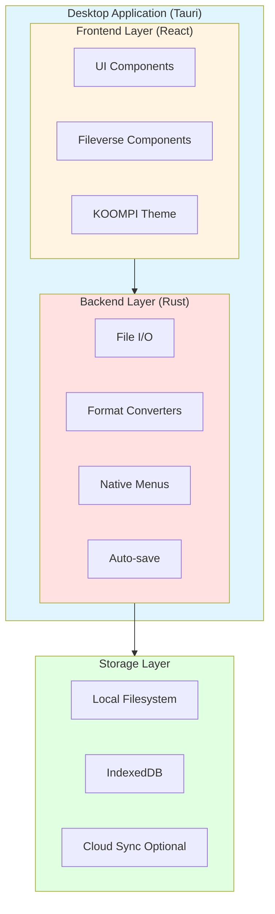

# KOOMPI Office Suite - Technical Specification

**Version:** 1.0  
**Status:** Design Phase - Approved  
**Last Updated:** 2025-12-19

---

## Executive Summary

KOOMPI Office is a privacy-first, offline-capable office suite built on Fileverse's open-source components, packaged as native desktop applications using Tauri. The suite provides MS Office format compatibility while maintaining local-first data storage and optional cloud synchronization.

### Components

1. **KOOMPI Writer** - Word processor (dDocs + Tauri)
2. **KOOMPI Sheets** - Spreadsheet application
3. **KOOMPI Slides** - Presentation tool

### Key Differentiators

- **Privacy:** No tracking, no mandatory cloud, full local control
- **Offline-First:** Works completely without internet
- **Lightweight:** Tauri-based (lighter than Electron)
- **Interoperable:** DOCX/XLSX/PPTX support
- **Open Source:** Built on Fileverse foundation

---

## 1. Architecture

### 1.1 High-Level Architecture



### 1.2 Technology Stack

| Layer | Technology | Version | Purpose |
|-------|-----------|---------|---------|
| **Desktop Framework** | Tauri | 1.5+ | Native desktop wrapper |
| **Frontend Framework** | React | 18+ | UI rendering |
| **Language** | TypeScript | 5+ | Type-safe frontend code |
| **Styling** | Tailwind CSS | 3+ | UI styling |
| **Editor Core** | Fileverse dDocs | Latest | Rich text editing |
| **Backend Language** | Rust | 1.70+ | Native operations |
| **Local Storage** | IndexedDB | - | Browser-based storage |
| **Filesystem** | Tauri FS API | - | Native file operations |

### 1.3 Component Architecture

#### KOOMPI Writer

```
koompi-writer/
├── src/                    # Rust backend
│   ├── main.rs             # Application entry
│   ├── file_ops.rs         # File I/O operations
│   ├── converters/
│   │   ├── docx_import.rs  # DOCX to JSON
│   │   └── docx_export.rs  # JSON to DOCX
│   └── settings.rs         # App settings
├── src-ui/                 # React frontend
│   ├── App.tsx             # Main app component
│   ├── components/
│   │   ├── Editor.tsx      # dDocs wrapper
│   │   ├── Menubar.tsx     # File/Edit menus
│   │   └── Toolbar.tsx     # Formatting toolbar
│   └── utils/
│       └── storage.ts      # IndexedDB wrapper
└── src-tauri/              # Tauri config
    └── tauri.conf.json     # Window, permissions
```

---

## 2. Functional Requirements

### 2.1 KOOMPI Writer (Word Processor)

#### Core Features

| Feature | Priority | Status | Notes |
|---------|----------|--------|-------|
| Rich text editing | P0 | Design | Bold, italic, underline, etc. |
| Paragraph formatting | P0 | Design | Headers, lists, alignment |
| Tables | P1 | Design | Insert, edit, format |
| Images | P1 | Design | Insert from filesystem |
| DOCX import | P0 | Design | Via mammoth.js |
| DOCX export | P0 | Design | Via docx library |
| PDF export | P1 | Design | Print to PDF |
| Auto-save | P0 | Design | Every 30 seconds |
| File associations | P1 | Design | `.docx`, `.koompi-doc` |

#### File Format Support

**Native Format:** `.koompi-doc` (JSON)
- Fast read/write
- Full fidelity
- P2P collaboration ready

**Import Formats:**
- `.docx` - Microsoft Word 2007+
- `.doc` - Legacy Word (limited)
- `.odt` - OpenDocument Text
- `.txt` - Plain text

**Export Formats:**
- `.docx` - Microsoft Word 2007+
- `.pdf` - Portable Document Format
- `.html` - Web page
- `.txt` - Plain text

### 2.2 KOOMPI Sheets (Spreadsheet)

#### Core Features

| Feature | Priority | Status | Notes |
|---------|----------|--------|-------|
| Grid editing | P0 | Design | Cell editing, navigation |
| Formulas | P0 | Design | SUM, AVG, IF, VLOOKUP, etc. |
| Charts | P1 | Design | Bar, line, pie charts |
| XLSX import | P0 | Design | Via xlsx library |
| XLSX export | P0 | Design | Preserve formulas |
| CSV support | P1 | Design | Import/export |
| Performance | P0 | Design | 10,000+ rows |
| Conditional formatting | P2 | Design | Color scales, icons |

#### Formula Engine

Support for common Excel formulas:
- **Math:** SUM, AVERAGE, MIN, MAX, ROUND
- **Logical:** IF, AND, OR, NOT
- **Lookup:** VLOOKUP, HLOOKUP, INDEX, MATCH
- **Text:** CONCATENATE, LEFT, RIGHT, MID
- **Date:** TODAY, NOW, DATE, YEAR, MONTH, DAY

### 2.3 KOOMPI Slides (Presentations)

#### Core Features

| Feature | Priority | Status | Notes |
|---------|----------|--------|-------|
| Slide creation | P0 | Design | Add, delete, reorder |
| Text formatting | P0 | Design | Titles, body text |
| Media insertion | P1 | Design | Images, videos |
| Shapes | P1 | Design | Rectangles, circles, arrows |
| Presentation mode | P0 | Design | Fullscreen playback |
| PPTX import | P1 | Design | Basic layout preservation |
| PPTX export | P1 | Design | Via pptxgenjs |
| Slide templates | P2 | Design | Pre-designed layouts |
| Transitions | P2 | Design | Simple slide transitions |

---

## 3. Non-Functional Requirements

### 3.1 Performance

| Metric | Target | Measurement |
|--------|--------|-------------|
| **App Launch Time** | < 2 seconds | Time to window open |
| **Document Load** | < 3 seconds | 100-page DOCX |
| **Save Time** | < 1 second | Any document size |
| **Memory Usage** | < 500MB | Per application |
| **CPU Idle** | < 5% | When not editing |

### 3.2 Reliability

- **Auto-save:** Every 30 seconds
- **Crash Recovery:** Restore unsaved changes
- **Data Integrity:** No corruption on crash
- **Undo/Redo:** Unlimited history

### 3.3 Security

- **No Telemetry:** Zero tracking or analytics
- **Local Storage:** Data never leaves device (unless cloud enabled)
- **Optional Encryption:** Encrypt local files (future)
- **Sandboxing:** Tauri security model

### 3.4 Accessibility

- **Keyboard Navigation:** Full keyboard support
- **Screen Reader:** ARIA labels on UI elements
- **High Contrast:** Support system themes
- **Zoom:** UI scaling for vision impaired

---

## 4. Data Storage

### 4.1 Local Storage Architecture

```
~/Documents/KOOMPI/
├── Writer/
│   ├── document1.koompi-doc    # Native JSON format
│   ├── document2.docx          # Imported DOCX
│   └── .recovery/              # Auto-save backups
├── Sheets/
│   ├── spreadsheet1.koompi-sheet
│   └── data.xlsx
└── Slides/
    ├── presentation1.koompi-slide
    └── deck.pptx
```

### 4.2 Document Format (Native)

**`.koompi-doc` Structure:**

```json
{
  "version": "1.0",
  "metadata": {
    "title": "Document Title",
    "author": "User Name",
    "created": "2025-12-19T11:00:00Z",
    "modified": "2025-12-19T11:15:00Z"
  },
  "content": {
    "type": "doc",
    "content": [
      {
        "type": "paragraph",
        "content": [
          {"type": "text", "text": "Hello ", "marks": []},
          {"type": "text", "text": "World", "marks": ["bold"]}
        ]
      }
    ]
  },
  "settings": {
    "pageSize": "A4",
    "margins": {"top": 25, "right": 25, "bottom": 25, "left": 25}
  }
}
```

### 4.3 IndexedDB Schema

Used for temporary storage and caching:

```typescript
interface IDBSchema {
  documents: {
    key: string;          // Document ID
    value: {
      id: string;
      path: string;       // Filesystem path
      content: any;       // Document JSON
      lastModified: Date;
      autoSave: boolean;
    };
  };
  
  recentFiles: {
    key: string;
    value: {
      path: string;
      type: 'writer' | 'sheets' | 'slides';
      lastOpened: Date;
      thumbnail?: string;
    };
  };
}
```

---

## 5. Format Conversion

### 5.1 DOCX Conversion

**Import (DOCX → JSON):**
- Library: `mammoth.js`
- Process:
  1. Read DOCX file via Tauri FS
  2. Extract XML content
  3. Parse to Fileverse JSON format
  4. Preserve formatting (bold, italic, headers, lists)
  5. Extract embedded images to local storage

**Export (JSON → DOCX):**
- Library: `docx` (npm package)
- Process:
  1. Traverse Fileverse JSON structure
  2. Build DOCX document object
  3. Apply formatting and styles
  4. Embed images
  5. Write DOCX file via Tauri FS

**Limitations:**
- Complex layouts may degrade
- Advanced Word features (SmartArt, macros) not supported
- Aim for 90% fidelity on common documents

### 5.2 XLSX Conversion

**Import/Export:**
- Library: `xlsx` (SheetJS)
- Supports:
  - Cell values and formulas
  - Basic formatting (bold, colors)
  - Multiple sheets
  - Charts (basic)

**Limitations:**
- Pivot tables not supported
- Macros/VBA not supported
- Advanced conditional formatting limited

### 5.3 PPTX Conversion

**Import:**
- Library: TBD (may use custom parser)
- Extract:
  - Slide content (text, images)
  - Basic layouts
  - Media files

**Export:**
- Library: `pptxgenjs`
- Generate:
  - Slides with text and images
  - Basic layouts
  - Simple transitions

**Limitations:**
- Animations not supported
- Complex SmartArt degrades
- Audio/video embedding limited

---

## 6. Cloud Synchronization (Optional)

### 6.1 Sync Providers

| Provider | Protocol | Priority | Notes |
|----------|----------|----------|-------|
| **WebDAV** | WebDAV | P0 | Nextcloud, ownCloud |
| **IPFS** | IPFS | P1 | Decentralized storage |
| **Fileverse Portal** | Ethereum | P2 | Original Web3 features |

### 6.2 Sync Architecture

```
Local Document
      ↓
  [User Edits]
      ↓
  Auto-save Local
      ↓
  [Sync Enabled?]
      ↓ Yes
  Upload to Provider
      ↓
  Conflict Resolution
      ↓
  Update Local if Needed
```

### 6.3 Conflict Resolution

**Strategy:** Manual resolution with diff view

1. Detect conflict (remote modified since last sync)
2. Show diff view to user
3. User chooses:
   - Keep local version
   - Keep remote version
   - Merge manually
4. Save resolution and sync

---

## 7. User Interface

### 7.1 Design Principles

- **Familiar:** Similar to MS Office, Google Docs
- **Clean:** Minimal distractions, focus on content
- **KOOMPI Branded:** Custom colors, icons, splash screen
- **Responsive:** Adapt to window size

### 7.2 Menu Structure

#### KOOMPI Writer

```
File
  ├── New (Ctrl+N)
  ├── Open (Ctrl+O)
  ├── Save (Ctrl+S)
  ├── Save As (Ctrl+Shift+S)
  ├── Export
  │   ├── PDF
  │   ├── DOCX
  │   └── HTML
  ├── Recent Files
  └── Exit

Edit
  ├── Undo (Ctrl+Z)
  ├── Redo (Ctrl+Y)
  ├── Cut (Ctrl+X)
  ├── Copy (Ctrl+C)
  ├── Paste (Ctrl+V)
  └── Select All (Ctrl+A)

Format
  ├── Bold (Ctrl+B)
  ├── Italic (Ctrl+I)
  ├── Underline (Ctrl+U)
  ├── Font Size
  ├── Heading 1-3
  └── Lists

Insert
  ├── Image
  ├── Table
  ├── Link
  └── Page Break

View
  ├── Zoom In/Out
  ├── Print Preview
  └── Fullscreen

Settings
  ├── Preferences
  ├── Cloud Sync
  └── About
```

---

## 8. Development Plan

### 8.1 Timeline (MVP)

| Week | Milestone | Deliverables |
|------|-----------|--------------|
| **1** | Setup | Fileverse audit, Tauri structure |
| **2-3** | Writer MVP | dDocs integration, DOCX export |
| **4-5** | Sheets MVP | dSheets or alternative, XLSX support |
| **6** | Slides MVP | Basic presentation tool |
| **7** | Polish | Format conversion, testing |
| **8** | Release | Documentation, packaging |

### 8.2 Team Allocation

- **Office Suite Architect** - Overall design, integration
- **Desktop Integration Dev** - Tauri backend, file I/O
- **Format Conversion Specialist** - DOCX/XLSX/PPTX conversion
- **Frontend Developer** - React UI, Fileverse integration

### 8.3 Dependencies

**Build Dependencies:**
- Node.js 18+
- Rust 1.70+
- Tauri CLI
- Webkit2gtk (Linux)

**NPM Packages:**
- `@fileverse-dev/ddoc`
- `mammoth` (DOCX import)
- `docx` (DOCX export)
- `xlsx` (Excel support)
- `pptxgenjs` (PowerPoint export)

---

## 9. Testing Strategy

### 9.1 Unit Tests

**Rust:**
```rust
// Format conversion tests
#[test]
fn test_docx_to_json_conversion() {
    let docx_path = "test.docx";
    let json = convert_docx_to_json(docx_path).unwrap();
    assert!(json.contains("\"type\":\"doc\""));
}
```

**TypeScript:**
```typescript
describe('Editor Component', () => {
  it('should render dDocs editor', () => {
    const { getByRole } = render(<Editor />);
    expect(getByRole('textbox')).toBeInTheDocument();
  });
});
```

### 9.2 Integration Tests

- File operations (open, save, export)
- Format conversion round-trips
- Auto-save functionality
- Cloud sync (if enabled)

### 9.3 Manual Testing

- DOCX compatibility with MS Word, LibreOffice
- XLSX compatibility with Excel, LibreOffice Calc
- Performance with large documents
- Offline functionality (disconnect test)

---

## 10. Risks & Mitigations

| Risk | Impact | Probability | Mitigation |
|------|--------|-------------|------------|
| Fileverse components incomplete | High | Medium | Evaluate alternatives ready |
| DOCX conversion quality poor | Medium | Low | Test early, iterate |
| Performance issues (Tauri) | Medium | Low | Benchmark, optimize |
| Maintenance burden (dependencies) | Low | Medium | Fork critical components |

---

## 11. Future Enhancements

### Phase 2 Features

- **Collaboration:** Real-time editing via CRDT
- **Mobile Apps:** iOS/Android with same backend
- **Advanced Formatting:** Styles, themes, templates
- **Grammar Check:** Integrate LanguageTool
- **Spell Check:** Multi-language dictionaries
- **Version History:** Git-like document versioning

### Phase 3 Features

- **Drawing Tools:** Diagrams, flowcharts
- **Database Integration:** Connect to SQL databases
- **Scripting:** Automation via JavaScript/Python
- **Plugins:** Extension system for third-party features

---

## 12. Success Metrics

### MVP Success Criteria

- ✅ All three apps working (Writer, Sheets, Slides)
- ✅ DOCX/XLSX/PPTX import/export functional
- ✅ 90% format compatibility with MS Office
- ✅ < 2 second launch time
- ✅ Works completely offline
- ✅ No crashes in normal use

### Adoption Metrics (Post-Launch)

- Active users per month
- Document format usage (native vs DOCX)
- Cloud sync adoption rate
- User feedback scores
- Bug reports per release

---

**Document Status:** Design Phase - Ready for Implementation  
**Next Steps:** Fileverse component audit, begin Tauri setup  
**Approved By:** KOOMPI Development Team  
**Date:** 2025-12-19
